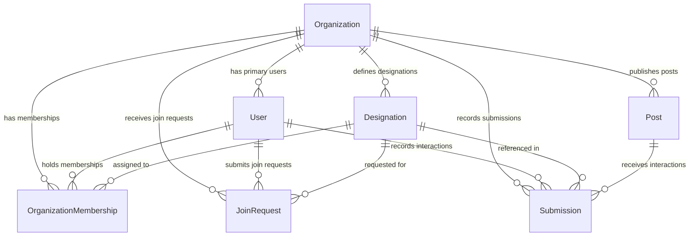

# Social Interaction Tracker (SIT) - Database Schema Report

**Database Provider**: PostgreSQL  
**ORM Framework**: Prisma Client v5  
**Document Version**: 2.0  
**Date**: July 30, 2026  

---

## 1. Entity-Relationship (ER) Overview

---

## 2. Table Definitions & Schemas

### 2.1 `Organization` Model
| Field | Type | Attributes / Constraints | Description |
|---|---|---|---|
| `id` | String | `@id @default(uuid())` | Primary key |
| `orgId` | String? | `@unique` | Formatted Organization ID (e.g. `ORG-1001`) |
| `uniqueCode` | String? | `@unique` | 8-character uppercase security code (e.g. `K8P2X9F4`) |
| `name` | String | Required | Organization official title |
| `officialEmail` | String | `@unique` | Corporate contact email |
| `passwordHash` | String? | Optional | Hash stored during registration for Org Super Admin |
| `status` | Enum | `@default(PENDING)` | `PENDING`, `ACTIVE`, `SUSPENDED`, `REJECTED` |
| `createdAt` | DateTime | `@default(now())` | Registration timestamp |
| `updatedAt` | DateTime | `@updatedAt` | Update timestamp |

### 2.2 `User` Model
| Field | Type | Attributes / Constraints | Description |
|---|---|---|---|
| `id` | String | `@id @default(uuid())` | Primary key |
| `name` | String | Required | User full name |
| `email` | String | `@unique` | Login email address |
| `passwordHash` | String | Required | bcrypt hash |
| `role` | String | `@default("USER")` | `PLATFORM_SUPER_ADMIN`, `ORGANIZATION_SUPER_ADMIN`, `ORGANIZATION_ADMIN`, `MEMBER`, `USER` |
| `active` | Boolean | `@default(true)` | Account active flag |
| `organizationId` | String? | Relation to Organization | Primary organization link |

### 2.3 `OrganizationMembership` Model
| Field | Type | Attributes / Constraints | Description |
|---|---|---|---|
| `id` | String | `@id @default(uuid())` | Primary key |
| `organizationId` | String | Foreign Key | Target Organization |
| `userId` | String | Foreign Key | Target User |
| `designationId` | String? | Foreign Key | Assigned Designation |
| `role` | String | Required | Membership role (`ORGANIZATION_SUPER_ADMIN`, `ORGANIZATION_ADMIN`, `MEMBER`) |
| `status` | String | `@default("ACTIVE")` | Membership status |

**Unique Constraint**: `@@unique([organizationId, userId])`

### 2.4 `JoinRequest` Model
| Field | Type | Attributes / Constraints | Description |
|---|---|---|---|
| `id` | String | `@id @default(uuid())` | Primary key |
| `organizationId` | String | Foreign Key | Target Organization |
| `userId` | String | Foreign Key | Applicant User |
| `designationId` | String | Foreign Key | Selected Designation |
| `status` | String | `@default("PENDING")` | `PENDING`, `APPROVED`, `REJECTED` |

**Unique Constraint**: `@@unique([organizationId, userId])`

### 2.5 `Designation` Model
| Field | Type | Attributes / Constraints | Description |
|---|---|---|---|
| `id` | String | `@id @default(uuid())` | Primary key |
| `organizationId` | String? | Foreign Key | Owning Organization |
| `designationName` | String | Required | Title (e.g. `MANAGER`, `EXECUTIVE`) |
| `active` | Boolean | `@default(true)` | Active flag |

**Unique Constraint**: `@@unique([organizationId, designationName])`

### 2.6 `Post` Model
| Field | Type | Attributes / Constraints | Description |
|---|---|---|---|
| `id` | String | `@id @default(uuid())` | Primary key |
| `organizationId` | String? | Foreign Key | Owning Organization |
| `title` | String | Required | Campaign title |
| `imageUrl` | String | Required | Media URL |
| `caption` | String? | Up to 5000 chars | Multiline description |
| `trackingCode` | String | `@unique` | 8-char tracking code |

### 2.7 `Submission` Model
| Field | Type | Attributes / Constraints | Description |
|---|---|---|---|
| `id` | String | `@id @default(uuid())` | Primary key |
| `organizationId` | String? | Foreign Key | Target Organization |
| `userId` | String? | Foreign Key | Submitting Member |
| `postId` | String | Foreign Key | Parent Post |
| `fullName` | String | Required | Capitalized employee name |
| `designationId` | String | Foreign Key | Employee designation |
| `facebookActions` | String? | JSON Array | `["Like", "Comment", ...]` |
| `instagramActions` | String? | JSON Array | `["Like", "Story", ...]` |
| `linkedinActions` | String? | JSON Array | `["Like", "Repost", ...]` |
| `xActions` | String? | JSON Array | `["Like", "Repost", ...]` |

**Unique Constraint**: `@@unique([postId, fullName, designationId], name: "unique_employee_post_submission")`
